# Meeting Room Manager

A PowerShell tool for Exchange Online meeting room provisioning — create, modify, delete, and audit room mailboxes in bulk from a structured Excel workbook, with pre-execution planning, typed confirmation guards, and colour-coded audit output.

---

## Problem and impact

Provisioning a meeting room in Exchange Online manually requires navigating the Exchange Admin Centre and configuring each property one by one — display name, location details, booking policy, room list membership, delegate groups, and calendar permissions. For a single room this takes around 45 minutes and is prone to inconsistency across operators.

This tool reduced that time to under 5 minutes per provisioning run. It also introduced a consistent, repeatable process with a built-in audit step that generates exportable evidence for the service request, replacing ad-hoc manual verification.

---

## How it works

The tool follows a deliberate multi-stage pipeline rather than executing changes immediately on launch:

```
Workbook import → Schema validation → Row parsing → Pre-execution planning → Typed confirmation → Row-by-row execution → Summary reporting
```

**Workbook-driven input** — room configuration data is supplied via a structured Excel workbook. The tool reads the workbook using Excel COM automation, validates the schema, and parses each row independently.

**Pre-execution planning** — before any Exchange Online call is made, the tool produces a parsed row summary and a planned action summary. Rows with validation errors are blocked and will not be processed. Clean rows are queued for execution.

**Typed confirmation guards** — the operator must type the exact operation name (`CREATE`, `MODIFY`, `DELETE`) to proceed. A miskey or Enter press alone will not trigger execution.

**Row-isolated execution** — each room is processed independently. A failure on one row does not abort the remaining rows. Live status is printed per-room as the run progresses.

**Colour-coded audit check** — the Check operation fetches live Exchange Online configuration and compares each field against the workbook values. Green = exact match, yellow = display name to SMTP match, red = mismatch. Results can be exported as `.txt` files for attaching to the service request as evidence.

---

## Operations

### 1 — Create

Provisions room mailboxes in Exchange Online. Create performs thin provisioning — it establishes the mailbox identity only. Full configuration is applied in the Modify step.

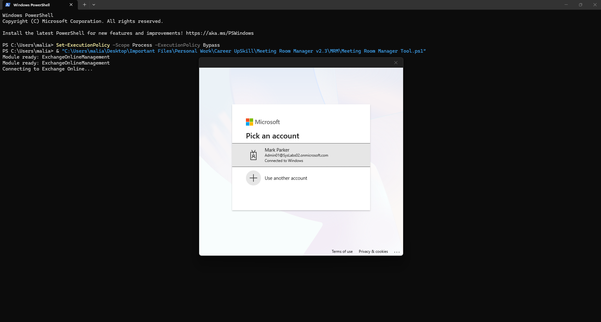

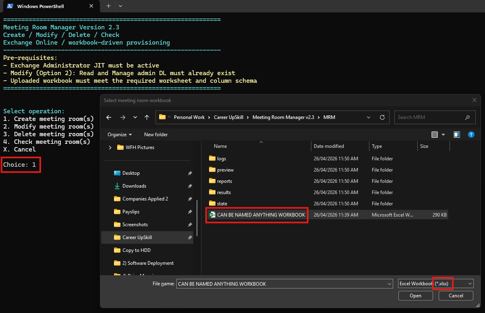

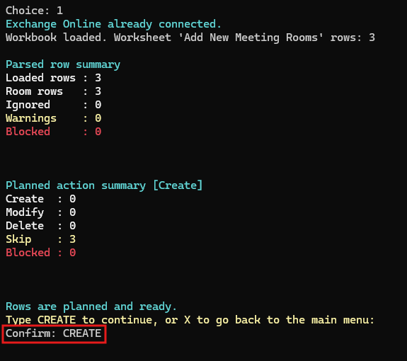

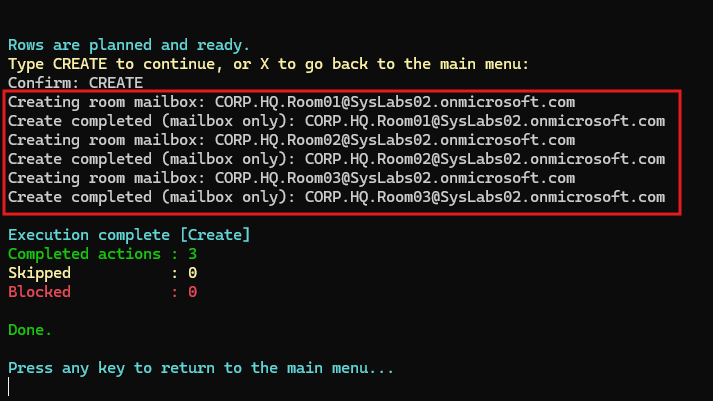

After Create, the rooms appear in the Exchange Admin Centre under Recipients → Resources. Location and contact fields are empty at this stage — this is expected.

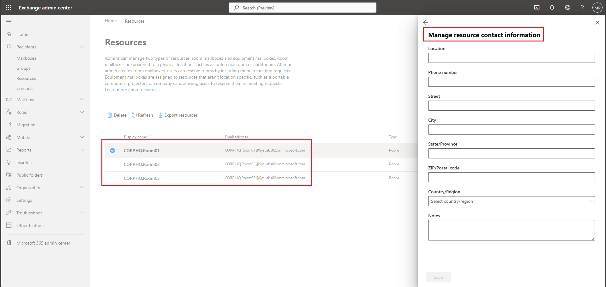

---

### 2 — Modify

Applies full configuration to existing room mailboxes — location data, booking policy, room list membership, approval workflow, and delegate groups. Run immediately after Create, or independently to update existing rooms.

> **Before running Modify:** the Read and Manage group listed in the workbook must already exist in Exchange Online as a **mail-enabled security group**. The tool does not create groups automatically.

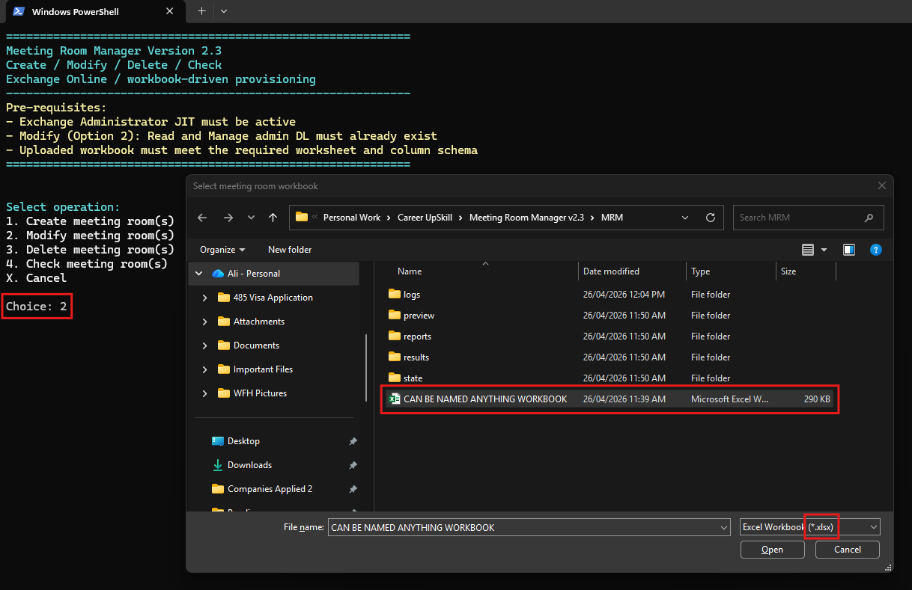

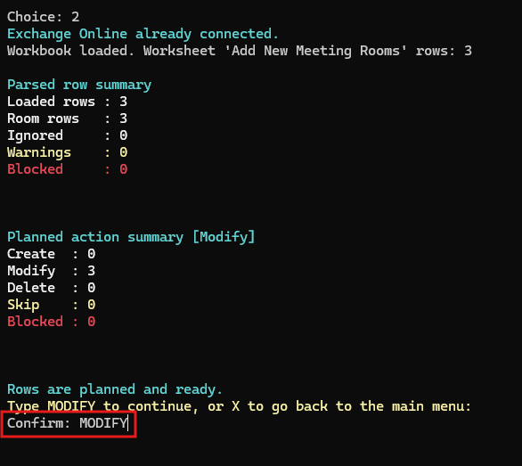

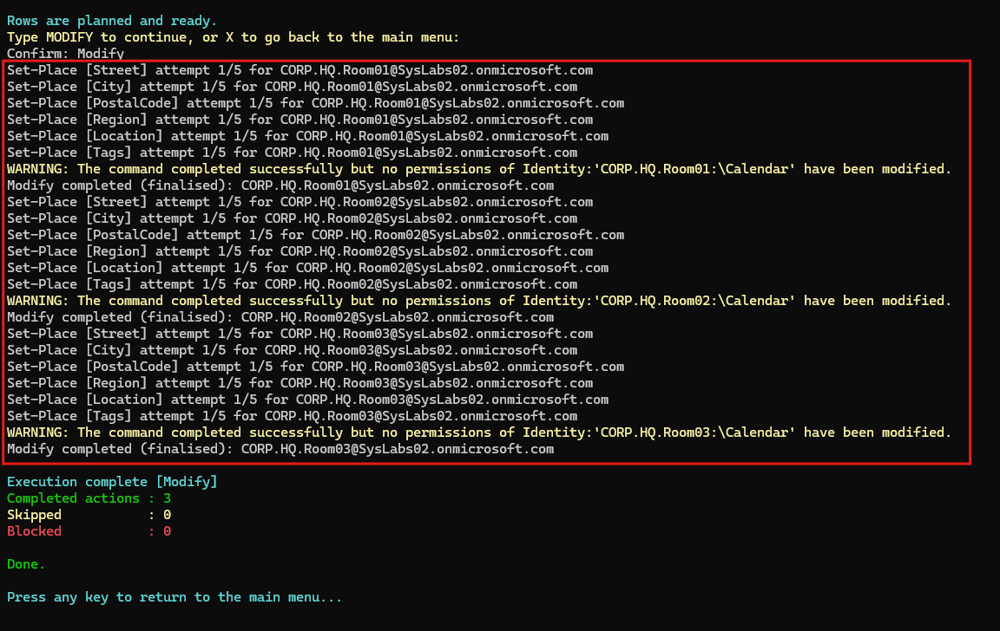

EAC verification after Modify — location fields populated from the workbook:

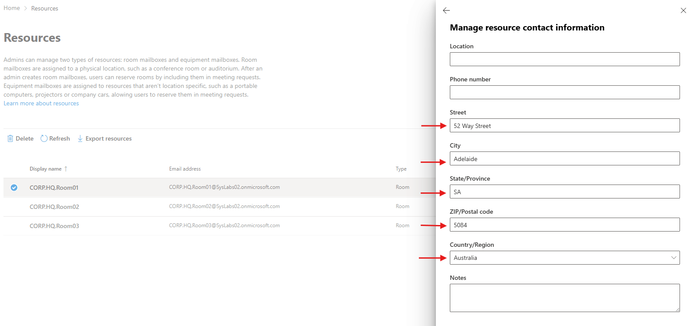

EAC verification — Read and Manage security group assigned as delegate:

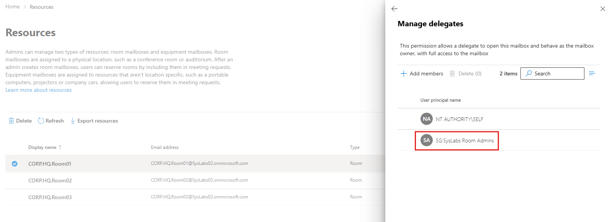

---

### 3 — Delete

Permanently removes room mailboxes. Supports bulk deletion via workbook or single-room deletion by typing the SMTP address directly. Each room requires the exact SMTP address to be typed or pasted as a final confirmation before removal.

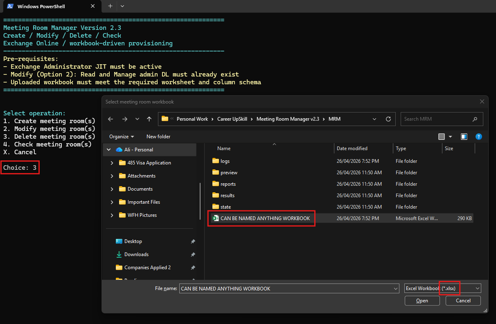

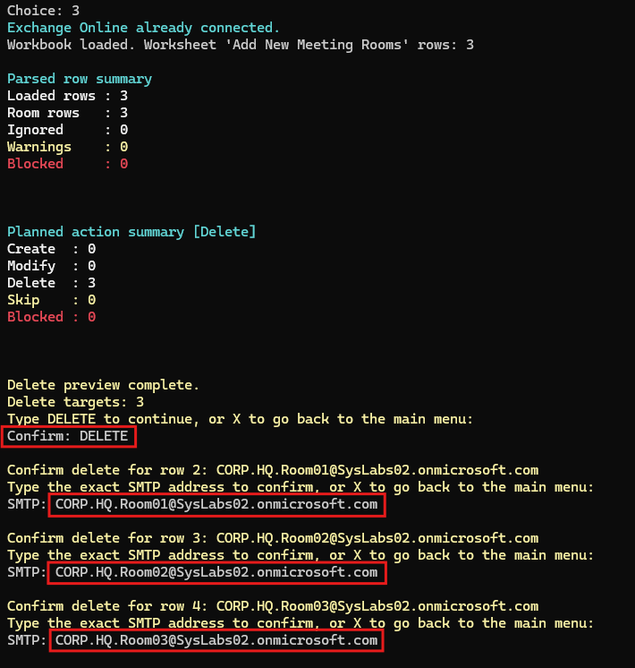

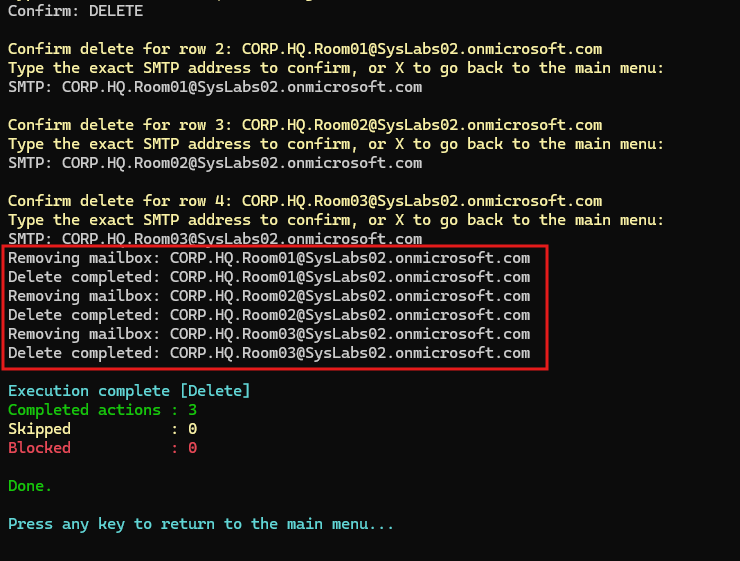

---

### 4 — Check

Fetches live Exchange Online configuration and compares it against the workbook. The output below shows a batch check across three rooms with different configurations — floor, capacity, tags, and approval settings — all returning fully green results after a successful Modify run.

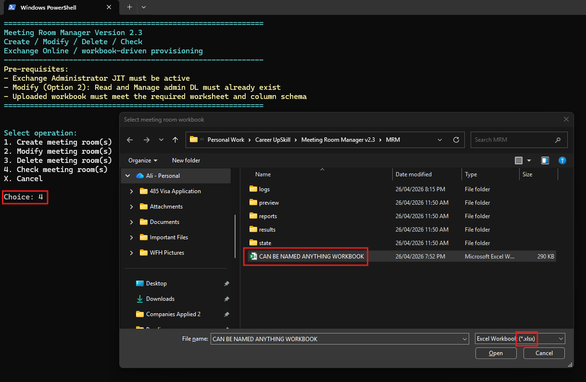

**Room01** — Requires Approval: Yes / Floor 5 / Capacity 5 / Tags: AV, Secured


**Room02** — Requires Approval: Yes / Floor 7 / Capacity 10 / Tags: No AV, Wellness

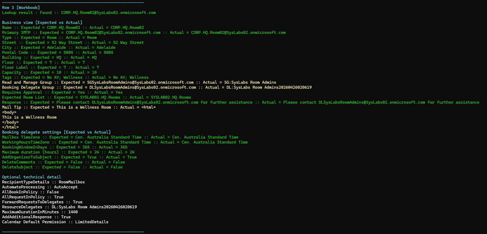

**Room03** — Requires Approval: No / Floor G / Capacity 25 / Tags: AV, PC

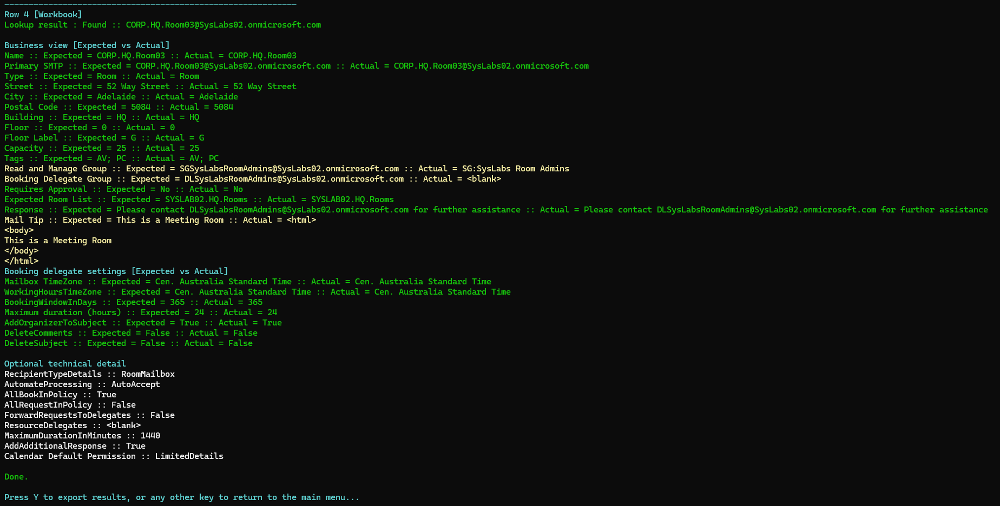

> **Note:** Yellow on `Booking Delegate Group` is expected when `Requires Approval = No`. No delegate group is assigned in that case — the tool correctly flags this as a partial match rather than a mismatch.

Results can be exported as `.txt` files for attaching to the service request:

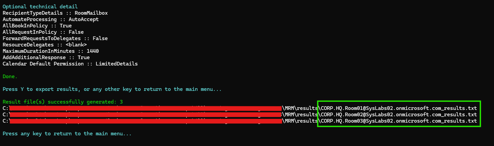

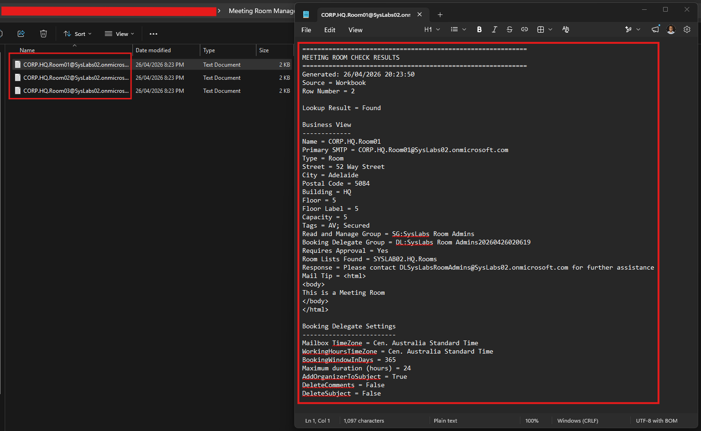

---

## Technical notes

| Item | Detail |
|---|---|
| Runtime | Windows PowerShell 5.1 (Desktop edition) — does not run under PowerShell 7 |
| Launch mode | STA (Single-Threaded Apartment) — required for Excel COM automation |
| Endpoint requirement | Standard non-CLM-enforced desktop — CLM/AppLocker-enforced endpoints will block unsigned scripts |
| Exchange module | ExchangeOnlineManagement — auto-installed at first run if absent |
| Auth | Exchange Administrator role must be active before launch (PIM/JIT activation where applicable) |
| Workbook | `.xlsx` or `.xls` — worksheet must be named `Add New Meeting Rooms` — see [Excel Requirements](docs/excel-requirements.pdf) |
| Modify prerequisite | Read and Manage group must be a mail-enabled security group — standard distribution lists cannot be assigned mailbox permissions |
| Retry logic | Set-Place commands retry up to 5 times with exponential backoff (5s / 10s / 15s / 20s) on transient failures |
| Error logging | Fatal exceptions are written to a timestamped log file in the `logs\` folder |

---

## Repository structure

```
meeting-room-manager/
├── README.md
├── MRM-Provision.ps1
├── docs/
│   ├── guide.html
│   ├── risk-register.pdf
│   ├── excel-requirements.pdf
│   └── changelog.pdf
├── template/
│   └── MRM-Template.xlsx
└── screenshots/
```

---

## Documentation

### [User Guide](docs/guide.pdf)
Step-by-step instructions for all four operations with screenshots. Covers both the CMD launcher and direct PowerShell launch methods including execution policy setup.

### [Excel Requirements](docs/excel-requirements.pdf)
Full workbook schema — mandatory and optional columns, field conventions, and validation rules. The workbook template is in `template/MRM-Template.xlsx`.

### [Risk Register](docs/risk-register.pdf)
Six identified risks covering: Exchange Online module and auth changes, PIM/JIT/Conditional Access drift, Windows PowerShell 5.1 dependency, Excel COM dependency, workbook schema drift, and STA/CLM endpoint incompatibility. Each entry includes trigger examples, impact assessment, risk level, and mitigations.

### [Changelog](docs/changelog.pdf)
Eight development iterations from initial proof-of-concept through to v2.3, documenting architectural decisions, feature additions, and breaking changes.

---

*Shared for portfolio and demonstration purposes. Organisation-specific identifiers have been replaced with generic equivalents.*
